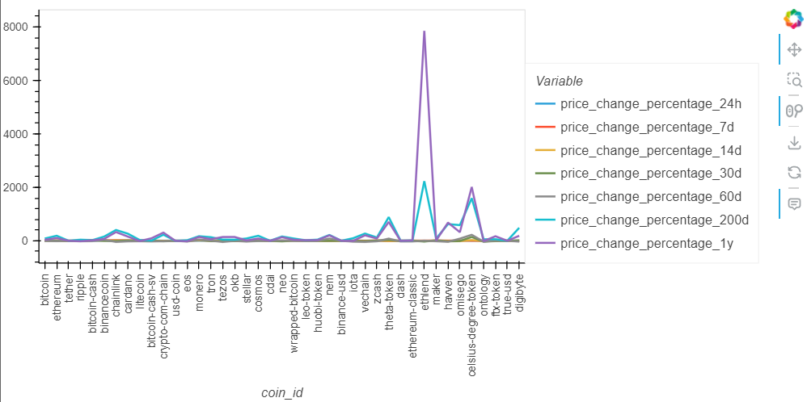
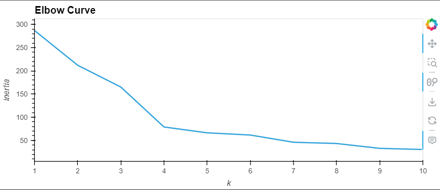
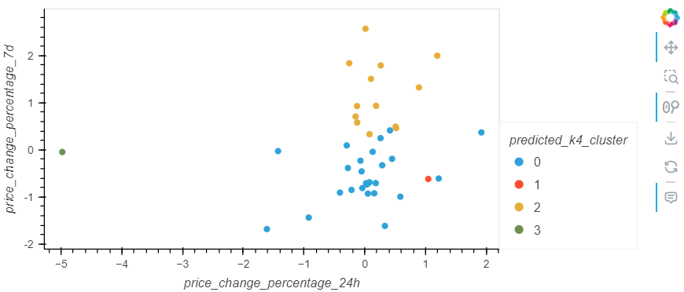
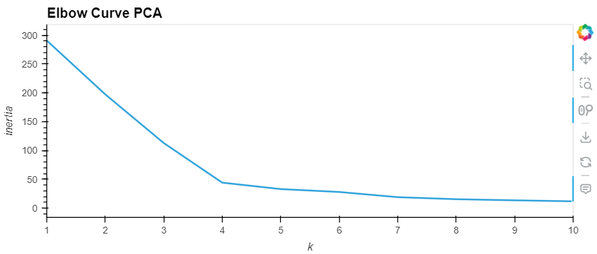
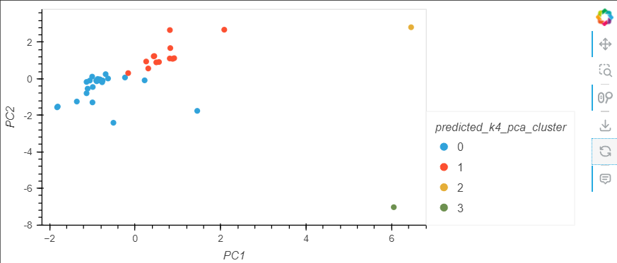

<h1 align = "center"> Crypto Clustering </h1>

This project focuses on analysing and clustering cryptocurrencies based on their market performance using unsupervised machine learning techniques. The analysis begins by normalising the data to prepare it for clustering, followed by applying the K-means algorithm to identify optimal groupings of cryptocurrencies. The elbow method is employed to determine the best number of clusters `k` by analysing the inertia values. After identifying the optimal `k`, the cryptocurrencies are clustered, and their behaviour is visualised in a scatter plot based on their 24-hour and 7-day price change percentages. This approach provides valuable insights into how different cryptocurrencies move together in the market.

To further optimise the clustering process, the project incorporates Principal Component Analysis (PCA) to reduce the data's dimensionality to three principal components. The elbow method is then applied again to find the best `k` value for the PCA-reduced data. By comparing clustering results from the original scaled data and the PCA data, the project evaluates the impact of dimensionality reduction on the clustering outcomes. The final visualisation showcases the clustered cryptocurrencies, offering a clearer understanding of their relationships and market dynamics, which is beneficial for investors and analysts in making informed decisions.

## Table of Contents

- [Criteria](#criteria)
- [Data](#data)
- [Results](#results)
- [References](#references)
- [License](#license)

## Criteria

## Data

This project utilises a primary CSV data source to analyse the market performance and clustering behaviour of various cryptocurrencies. The dataset, generated by edX Boot Camps LLC for educational purposes, provides a realistic foundation for applying unsupervised learning techniques.

| Column                       | Description                                                                           | Information                                                                                                               |
| ---------------------------- | ------------------------------------------------------------------------------------- | ------------------------------------------------------------------------------------------------------------------------- |
| coin_id                      | A unique identifier for each cryptocurrency.                                          | Contains the names or symbols representing different cryptocurrencies, such as Bitcoin (BTC), Ethereum (ETH), etc.        |
| price_change_percentage_24h  | The percentage change in the price of a cryptocurrency over the last 24 hours.        | Indicates the short-term volatility and performance of the cryptocurrency on a daily basis.                               |
| price_change_percentage_7d   | The percentage change in the price of a cryptocurrency over the past 7 days.          | Helps to understand the weekly performance and trend of the cryptocurrency.                                               |
| price_change_percentage_14d  | The percentage change in the price of a cryptocurrency over the last 14 days.         | Provides insights into the bi-weekly price movement of the cryptocurrency.                                                |
| price_change_percentage_30d  | The percentage change in the price of a cryptocurrency over the past 30 days.         | Indicates the monthly price fluctuation, offering a broader view of the cryptocurrency's trend over a month.              |
| price_change_percentage_60d  | The percentage change in the price of a cryptocurrency over the last 60 days.         | Helps in understanding the medium-term price changes of the cryptocurrency over two months.                               |
| price_change_percentage_200d | The percentage change in the price of a cryptocurrency over the past 200 days.        | Represents the longer-term trend of the cryptocurrency, helping to assess its performance over approximately six months.  |
| price_change_percentage_1y   | The percentage change in the price of a cryptocurrency over the last year (365 days). | Provides a long-term perspective on the cryptocurrency's price movement and overall market behaviour over an entire year. |

## Result

## References

Data for this dataset was generated by edX Boot Camps LLC, and is intended for educational purposes only.

## License

This project is licensed under the [MIT License](https://github.com/Yukitoshi12345/CryptoClustering/blob/main/LICENSE).
